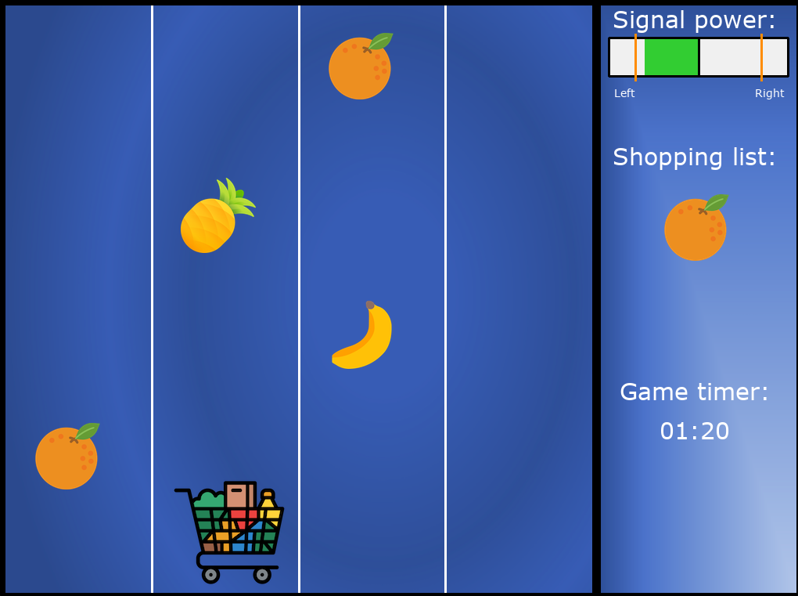

# **Fruit Rally**
This project demonstrates how to integrate a Brain-Computer-Interface device ([Emotiv](https://www.emotiv.com/)) with a desktop-based Python game implemented with pygame. The integration is based on the [Emotiv Cortex API](https://emotiv.gitbook.io/cortex-api/) and uses an implementation with the [Twisted framework](https://autobahn.readthedocs.io/en/latest/reference/autobahn.twisted.html) for asynchronous WebSocket interaction. With this integration, the game is able to receive mental commands and it can be controlled completely with brain signals from a BCI device.

Besides, the project can be simulated with a virtual brain wear device (Emotiv) or a keyboard.

## Game
This is a simple memory game. All you have to  do is to remember
the shopping list and recall it during the game in the correct order by putting the items into the shopping cart. You will have only 7 seconds to memorize the shopping list. For collecting items that are not on the list you will get 5 seconds additionally to your score time. The goal is to catch all items on your list as fast as possible. 

Since mental command training is quite complicated. You can have a strong signal for right-command and a weak signal for left-command, in the game you will get tested on your command power. Based on this score you will get specified minimal power of the signal for the move.

## **How to run this project**

To run this project it is recommended to setup a virtual environment by using requirements.txt file.

1.  `python3 -m venv .venv`
2.  `source .venv/bin/activate`
3.  `pip install -r requirements.txt`

4. For using BCI(Emotiv) add your user credentials into _user_credentials.py_ under 

        `"client_id": "<your id>",
        
        "client_secret": "<your secret>"`
        
   _if you don't know your credentials visit https://www.emotiv.com/my-account/cortex-apps/ and/or register a new application._

5. run the game: 

    `python src/mainGameLoop.py`

## **Credits**

Sounds:

- fail-buzzer.wav and 
- magic-chime.wav were taken from https://www.soundjay.com/. Copyright provides free use https://www.soundjay.com/tos.html
- GameSong.wav created by Olga Zharikova

Images: 

- all figure images were taken from https://www.freepikcompany.com
    - apple: Icon made by Good Ware from www.flaticon.com
    - banana: Icon made by Pixel Perfect from www.flaticon.com
    - grapes: Icon made by Freepik from www.flaticon.com
    - lemon: Icon made by Freepik from www.flaticon.com
    - orange: Icon made by Smashicons from www.flaticon.com
    - pineapple: Icon made by Freepik from www.flaticon.com
    - shopping cart: Icon made by iconixar from www.flaticon.com
    
- backgrounds and menu pictures created by Olga Zharikova 

Fonts:

- verdana.ttf - Copyright © Microsoft Corporation. Designer: Matthew Carter

